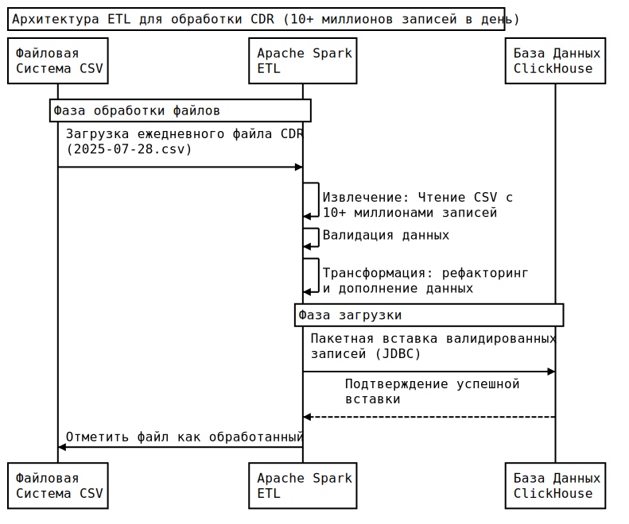

# ETL для загрузки CDR (Call Detail Record)

## Описание

Это приложение реализует процесс ETL (Extract, Transform, Load) для загрузки, валидации и хранения CDR (Call Detail
Record) — детальных записей о телефонных звонках. Данные загружаются из CSV-файлов, валидируются и сохраняются в базу
данных. Предоставляется REST API для загрузки файлов и получения данных с фильтрацией, пагинацией и сортировкой.

## Требования

- Java 21
- Gradle (wrapper включён)
- Quarkus
- H2 Database (in-memory, настраивается через application.yml)

## Установка и запуск

1. Клонируйте репозиторий:
   ```sh
   git clone <repo-url>
   cd mts-task
   ```
2. Запустите приложение:
   ```sh
   ./gradlew quarkusDev
   ```
3. Приложение будет доступно на http://localhost:8080

## Структура проекта

```
mts-task/
├── build.gradle           # Конфигурация Gradle
├── gradle.properties      # Свойства сборки
├── settings.gradle        # Настройки Gradle
├── src/
│   ├── main/
│   │   ├── java/dev/nexonm/
│   │   │   ├── dto/       # DTO для запросов/ответов
│   │   │   ├── entity/    # JPA-сущности (Agent, CallDetailRecord)
│   │   │   ├── mapper/    # Мапперы для преобразования данных
│   │   │   ├── resource/  # REST API ресурсы
│   │   │   ├── service/   # Бизнес-логика (ETL, генерация, валидация)
│   │   │   └── ExampleResource.java # Пример ресурса
│   │   ├── resources/
│   │   │   ├── application.yml # Конфиг приложения (БД, логирование)
│   │   │   └── init.sql        # Скрипт создания и наполнения БД
│   │   └── docker/             # Dockerfile (не используется)
│   ├── test/                   # (Папка для тестов, не используется)
│   └── native-test/            # (Папка для тестов, не используется)
├── data/                       # Пример CSV-файлов для загрузки
```

### Важные файлы

- **init.sql** — создаёт таблицы, индексы и наполняет справочник агентов
- **application.yml** — настройки БД, логирования, Hibernate

## Структура базы данных

- **agents** (справочник агентов)
    - `agent_id` (PK)
    - `name` (название компании)
    - `account` (лицевой счёт, уникальный)

- **call_detail_records** (CDR)
    - `id` (PK)
    - `call_time` (дата и время звонка)
    - `number_a` (исходящий номер)
    - `number_b` (входящий номер)
    - `duration` (продолжительность, сек)
    - `agent_id` (FK на agents)

**Связь:**

- Один агент — много CDR (1:N)

## Формат CSV-файла

- Имя файла: `YYYY-MM-DD.csv` (например, `2025-07-26.csv`)
- Структура:

  | time | numberA | numberB | duration | account |
    |----------|--------------|--------------|----------|-----------|
  | 09:30:15 | 79161234567 | 79267654321 | 180 | account1 |

- time — только время (дата берётся из имени файла)
- account должен существовать в справочнике агентов

## REST API

### 1. Загрузка и обработка CSV-файла

**POST** (GET) `/api/cdr/input?path=путь_к_файлу`

- Запускает ETL: читает данные из CSV, валидирует и сохраняет данные в H2
- Пример:
  ```sh
  curl "http://localhost:8080/api/cdr/input?path=data/2025-07-26.csv"
  ```
- Ответ: JSON с результатом ETL (количество строк, ошибки валидации и т.д.)

### 2. Получение CDR-записей

**GET** `/api/cdr`

- Параметры:
    - `agentId` — фильтр по агенту
    - `timeFrom`, `timeTo` — диапазон времени (например, 2025-07-26T00:00:00)
    - `page`, `size` — пагинация
    - `sortBy` — поле сортировки (`callTimestamp`, `numberA`, `numberB`, `duration`, `agentName`)
    - `sortDirection` — сортировка по убыванию
- Пример:
  ```sh
  curl "http://localhost:8080/api/cdr?agentId=1&timeFrom=2025-07-26T00:00:00&timeTo=2025-07-27T23:59:59&page=0&size=10&sortBy=callTimestamp&sortDirection=ASC"
  ```
- Ответ: JSON-массив CDR-записей

### 3. Генерация тестовых данных

**GET** `/api/test-data/generate?date=YYYY-MM-DD&count=N`

- Генерирует N тестовых записей за дату, сохраняет в CSV
- Пример:
  ```sh
  curl "http://localhost:8080/api/test-data/generate?date=2025-07-27&count=10000"
  ```

### 4. Очистка сгенерированных файлов

**GET** `/api/test-data/cleanup`

- Удаляет все сгенерированные CSV-файлы в папке data/
- Пример:
  ```sh
  curl "http://localhost:8080/api/test-data/cleanup"
  ```

## Производительность

- Программа может обрабатывать до **20 000 000** записей в одном файле (такой файл весит примерно 1ГБ)
- Пример: 10 000 000 записей (500МБ) генерируется и загружаются за ~6 минут

## Процесс исполнения при загрузке данных

1. Нахождение файла
2. Валидация данных
    1. Чтение пакета строк (1.000.000)
    2. Валидация пакета строк
    3. Запись ошибок (если найдены)
    4. Повторить шаги 1-3 пока есть строки
3. Сохранение данных (при отсутствии ошибок)
    1. Чтение пакета строк
    2. Трансформация в сущность
    3. Загрузка пакета в базу данных
    4. Повторить шаги 1-3 пока есть строки
4. Возвращение ответа в виде репорта

## Базовое тестирование

- Выполните запрос на создание тестовых записей в CSV файле:

```sh
http://localhost:8080/api/test-data/generate?count=100000
```

- Выполните обработку файла (чтение, валидация, сохранение в бд), указав валидное имя файла:

```sh
http://localhost:8080/api/cdr/input?path=data/filename.csv
```

- Отправьте запросы поиска с фильтрацией (замените данные где требуется, например в дате):

```sh
http://localhost:8080/api/cdr
http://localhost:8080/api/cdr?agentId=1
http://localhost:8080/api/cdr?size=5
http://localhost:8080/api/cdr?timeFrom=2025-07-26T09:00:00&timeTo=2025-07-27T17:59:59
http://localhost:8080/api/cdr?sortBy=agentId&sortDirection=DESC
```

- Попробуйте изменить данные в csv файле:
    - Укажите несуществующего агента (5 столбец)
    - Удалите один из телефонов
    - Удалите одну из строк, оставив её пустой
    - Укажите отрицательное время звонка
    - Попробуйте что-нибудь ещё и расскажите, если найдёте баг ;)

## Использование ClickHouse

**ClickHouse** — база данных колоночного типа с поддержкой SQL, основным преимуществом которой является обработка
больших (миллионы записей) массивов данных для предоставления аналитики.

### Плюсы использования

- **Быстрая обработка аналитических запросов** благодаря колоночному и отсортированному хранению данных,
- **Быстрая загрузка больших объёмов данных** из CSV файла напрямую в базу данных,
- **Экономия места** за счёт увеличенного коэффициента сжатия данных (данные одной колонки хранятся в отдельных файлах,
  что позволяет эффективно сжимать данные одного типа),
- **Нативный REST API** позволит сэкономить время разработки.

В основном использование ClickHouse в данном проекте позволит сократить время загрузки и обработки данных при условии
миллионов записей.

### Минусы использования

- **Ограниченная валидация данных** в ClickHouse требует отдельной проверки данных перед вставкой в БД,
- **Временные траты на JOIN операции** требуют денормализации данных,
- **Отсутствие ACID** требует отдельных маханизмов валидации целостности данных,
- **Возможная избыточность** для данного проекта (если подразумевается малый объём данных, менее миллиона записей).

## Использование Apache Spark

**Apache Spark** - движок для аналитики больших данных в оперативной памяти. Основное преимущество - обработка данных в
оперативной памяти, что кратно увеличивает скорость.

Основная задача данного проекта - предоставление аналитики по данным, поэтому ограниченность update/delete операций была
опущена.

### Плюсы использования

- **Быстрая валидация данных** за счёт богатого набора функций для валидации данных,
- **Высокая производительность** за счёт работы программы в оперативной памяти,
- **Лёгкая масштабируемость** позволяет быстро подстраиваться под растущую нагрузку.

Apache Spark может значительно ускорить и улучшить этапы валидации данных при загрузке данных. Это позволит закрыть
некоторые недостатки ClickHouse.

### Минусы использования

- **Высокое потребление ресурсов** и в особенности RAM, что может быть избыточно для небольших объёмов CDR,
- **Сложность в настройке** требует больше времени и знаний,
- **Возможная избыточность** для данного проекта (если подразумевается малый объём данных, менее миллиона записей).

Основным минусом Spark является потребление ресурсов, что может сказаться на стоимости серверной развёртываемости.

## Добавление Apache Spark и ClickHouse в проект

При условии загрузки более 1 миллиона записей в день, комбинирование Apache Spark и ClickHouse позволит создать
высоконагруженную систему с упором на производительность и масштабирование.

Предложения для улучшения:

- Использование Apache Spark для валидации и трансформации первичных данных,
- Использование ClickHouse для хранения данных и предоставления данных.

Улучшенная архитектура проекта:


## Улучшение проекта

Для улучшения проекта можно покрыть код Unit тестами, integration тестами. Так же можно подумать об асинхронной
обработке данных из файла (если не использовать Apache Spark) и подключении отдельной базы данных (например, PostgreSQL 
вместо H2).

## Автор

- Nikita Maksimenko, [@Nexonm](https://t.me/Nexonm)
